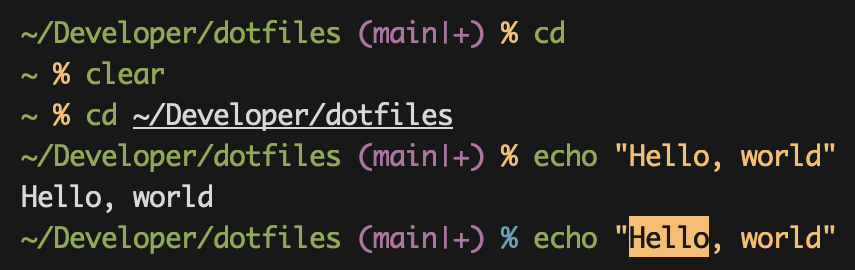

# pronto

Super simple Zsh prompt with Git integration and vi-mode support.

## Features

- Abbreviated directory paths (Fish-style truncation: `~/D/a/pronto`)
- Git branch and status indicators (`|+` unstaged, `|*` staged, `|!` untracked)
- Vi-mode visual indication (yellow/blue prompt character)
- Exit status indication (red prompt character on command failure)
- `edit-command-line` support (`Alt+e` in command mode, `Ctrl+e` in insert mode)

## Installation

1. Clone the repository: `git clone https://github.com/arzezak/pronto.git`
2. Source the theme file: `source pronto.zsh-theme`
3. Or add `source /path/to/pronto.zsh-theme` to your `.zshrc`

## Documentation

- [Walkthrough](WALKTHROUGH.md) - Line-by-line explanation of how the theme works
