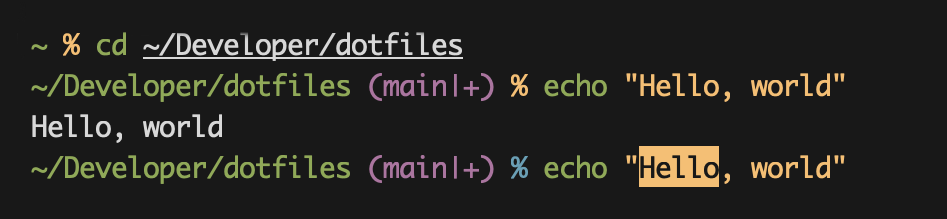

# pronto

Super simple Zsh prompt with Git integration and vi-mode support.

## Features

- Git branch and status indicators (`|+` unstaged, `|*` staged, `|!` untracked)
- Vi-mode visual indication (yellow/blue prompt character)
- `edit-command-line` support (`;` in command mode, `Ctrl+;` in insert mode)
- `jk` to switch from insert to command mode

## Installation

1. Clone the repository: `git clone https://github.com/arzezak/pronto.git`
2. Source the theme file: `source pronto.zsh-theme`
3. Or add `source /path/to/pronto.zsh-theme` to your `.zshrc`
